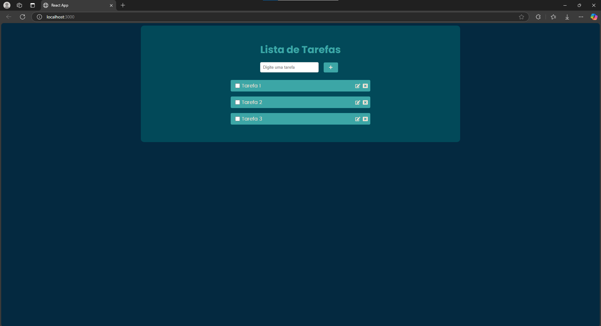

# 📝 Lista de Tarefas com React

Uma aplicação simples de lista de tarefas construída com **React**. Este projeto foi criado com foco no aprendizado de conceitos fundamentais de componentes, estado, props, manipulação de eventos e persistência de dados com `localStorage`.

## 🚀 Funcionalidades

- Adicionar novas tarefas
- Editar tarefas existentes
- Deletar tarefas
- Validação para evitar tarefas duplicadas
- Persistência dos dados no `localStorage` do navegador
- Interface responsiva e estilizada com CSS puro
- Ícones interativos com `react-icons`

## 📸 Demonstração



## 🛠️ Tecnologias Utilizadas

- [React](https://reactjs.org/)
- [JavaScript (ES6+)](https://developer.mozilla.org/pt-BR/docs/Web/JavaScript)
- [React Icons](https://react-icons.github.io/react-icons/)
- CSS puro


## 🧠 Aprendizados

Durante o desenvolvimento deste projeto, aprendi a:

- Criar e gerenciar estado de componentes com `this.state`
- Trabalhar com eventos em formulários (como `onSubmit`, `onChange`)
- Atualizar dinamicamente listas com base em entradas do usuário
- Persistir e recuperar dados do `localStorage`
- Criar componentes reutilizáveis e organizados

## 💻 Como Rodar Localmente

1. Clone o repositório:

```bash
git clone https://github.com/seu-usuario/nome-do-repo.git
cd nome-do-repo

npm install

npm start
```

## 📄 Licença

1. Este projeto está sob a licença MIT.

Feito com 💻 por Arthur Bressan
